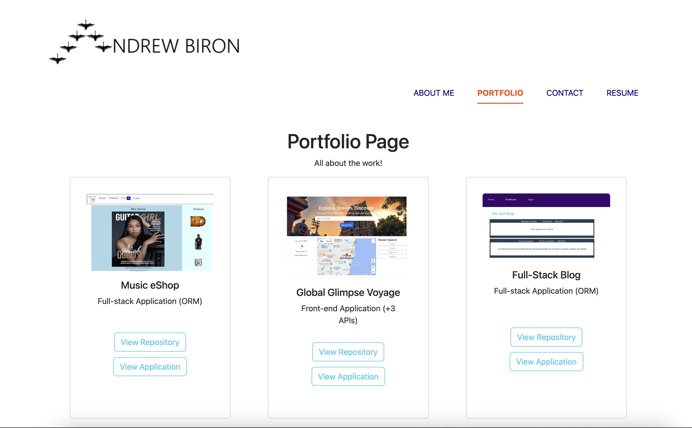

# React Portfolio

## Building a React Portfolio

The purpose of this project is to create a portfolio using React. This is a front-end (Client-side) development project. In the application, the user is presented with an About Me, Portfolio, Contact, and Resume pages. Developing this project demonstrates our Front-end development skills using React and Vite.

This project was developed with Vite version 4.4.5 Using React assisted in forming and structuring of the application. Along with creating components, we are able to re-use the components with ease

The following is an image is the portfolio page that displays past projects.

## Installation

N/A

## Usage

To view the application in action, simply click the following link: https://singular-starship-94ebaa.netlify.app/#about
The link will redirect you to the deployed site where the user can see the application in action. The React Portfolio application functionality allows the user to view the developer's portfolio. The users can also contact the developer. 

## Credits

N/A

## License

Please refer to the LICENSE in the repo.